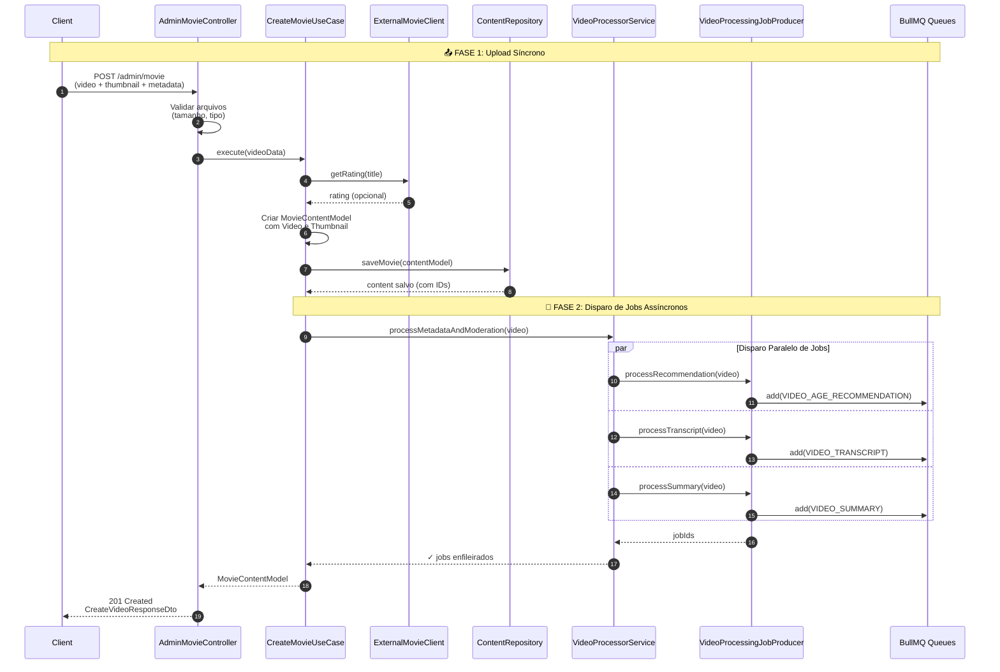
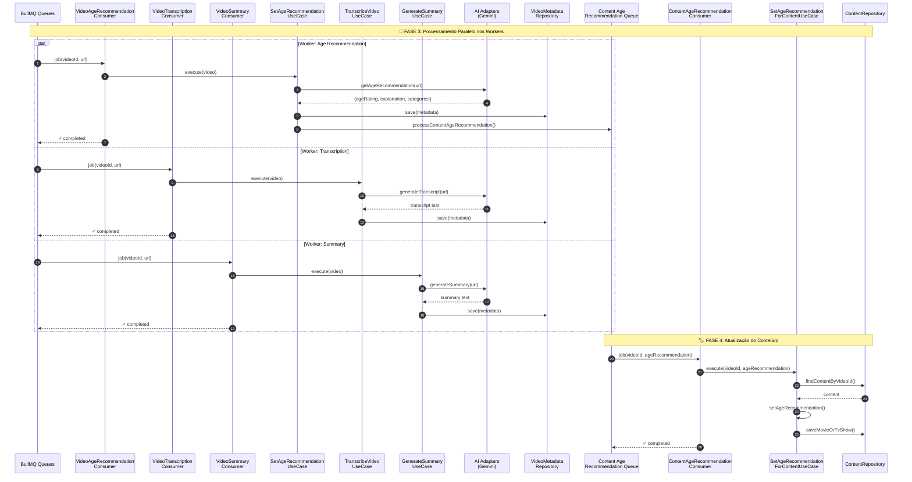
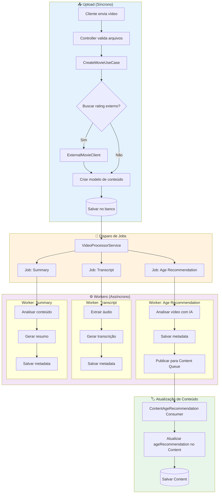

# Content Module

O módulo de conteúdo gerencia todo o ciclo de vida de conteúdos de mídia (filmes e séries), incluindo upload, processamento assíncrono, catalogação e streaming.

## Funcionalidades Principais

- **Gerenciamento de Filmes**: Upload, metadados e catalogação
- **Gerenciamento de Séries (TV Shows)**: Criação de séries com múltiplos episódios
- **Processamento de Vídeo**: Transcrição, resumo automático e classificação etária
- **Streaming**: Geração de URLs de streaming para reprodução
- **Integração Externa**: Busca de ratings externos (ex: TMDB)

## Arquitetura

Este módulo segue os princípios de arquitetura modular e é dividido em **sub-domínios**:

```
content/
├── content.module.ts           # Módulo principal
├── admin/                      # Sub-domínio: Administração de conteúdo
│   ├── core/
│   │   ├── model/
│   │   ├── service/
│   │   └── use-case/
│   ├── http/
│   │   ├── client/             # Clientes externos (TMDB)
│   │   └── rest/
│   ├── persistence/
│   └── queue/
│       ├── consumer/
│       └── producer/
├── catalog/                    # Sub-domínio: Catálogo e streaming
│   ├── core/use-case/
│   └── http/rest/
├── video-processor/            # Sub-domínio: Workers de processamento
│   ├── core/
│   │   ├── adapter/            # Interfaces de integração (AI/ML)
│   │   └── use-case/
│   ├── http/client/            # Clientes de IA (Gemini)
│   ├── persistence/
│   └── queue/
│       ├── consumer/           # Workers que processam jobs
│       └── producer/
└── shared/                     # Código compartilhado no domínio
    ├── core/
    ├── persistence/
    └── queue/
```

## Fluxos

### Fluxo Completo de Upload de Vídeo

O upload de vídeo é um processo que combina operações síncronas (upload e persistência) com processamento assíncrono em workers.



### Processamento Assíncrono nos Workers



### Visão Geral do Fluxo



## Filas (Queues)

| Fila | Produtor | Consumidor | Descrição |
|------|----------|------------|-----------|
| `video-age-recommendation` | VideoProcessingJobProducer | VideoAgeRecommendationConsumer | Análise de classificação etária |
| `video-transcript` | VideoProcessingJobProducer | VideoTranscriptionConsumer | Transcrição de áudio |
| `video-summary` | VideoProcessingJobProducer | VideoSummaryConsumer | Geração de resumo |
| `content-age-recommendation` | ContentAgeRecommendationQueueProducer | ContentAgeRecommendationConsumer | Atualização do conteúdo |

## API Endpoints

### Admin - Filmes

| Método | Endpoint | Descrição |
|--------|----------|-----------|
| `POST` | `/admin/movie` | Upload de filme com vídeo e thumbnail |

### Admin - Séries (TV Shows)

| Método | Endpoint | Descrição |
|--------|----------|-----------|
| `POST` | `/admin/tv-show` | Criar série com thumbnail |
| `POST` | `/admin/tv-show/:contentId/upload-episode` | Upload de episódio |

### Catalog - Streaming

| Método | Endpoint | Descrição |
|--------|----------|-----------|
| `GET` | `/catalog/stream/:videoId` | Obter URL de streaming |

## Exemplo de Request/Response

### Upload de Filme

**Request:**
```http
POST /admin/movie
Content-Type: multipart/form-data

video: [arquivo.mp4]
thumbnail: [thumbnail.jpg]
title: "Meu Filme"
description: "Descrição do filme"
```

**Response:**
```json
{
  "id": "uuid-content-id",
  "title": "Meu Filme",
  "description": "Descrição do filme",
  "url": "./uploads/1234567890-uuid.mp4",
  "thumbnailUrl": "./uploads/1234567890-uuid.jpg",
  "sizeInKb": 1048576,
  "duration": null,
  "createdAt": "2024-01-15T10:30:00.000Z",
  "updatedAt": "2024-01-15T10:30:00.000Z"
}
```

## Serviços Principais

| Serviço | Responsabilidade |
|---------|------------------|
| `CreateMovieUseCase` | Orquestra criação de filme |
| `CreateTvShowUseCase` | Orquestra criação de série |
| `CreateTvShowEpisodeUseCase` | Adiciona episódio a série |
| `VideoProcessorService` | Dispara jobs de processamento |
| `TranscribeVideoUseCase` | Gera transcrição via IA |
| `GenerateSummaryForVideoUseCase` | Gera resumo via IA |
| `SetAgeRecommendationUseCase` | Determina classificação etária |
| `GetStreamingUrlUseCase` | Gera URL de streaming |

## Adapters (Integrações)

O módulo usa o padrão Adapter para integrações externas:

| Adapter | Responsabilidade |
|---------|------------------|
| `VideoTranscriptGenerationAdapter` | Geração de transcrição (Gemini) |
| `VideoSummaryGenerationAdapter` | Geração de resumo (Gemini) |
| `VideoAgeRecommendationAdapter` | Classificação etária (Gemini) |

## Tratamento de Erros nos Workers

Cada worker implementa:
- `onFailed`: Callback para jobs que falharam
- `onApplicationShutdown`: Graceful shutdown do worker
- Logs estruturados para debugging

```typescript
@OnWorkerEvent('failed')
onFailed(job: Job, error: Error) {
  this.logger.error(`Job failed: ${job.id}`, { job, error });
  // Opções: notificar, enviar para DLQ, retry manual
}
```

## Documentação Relacionada

- [Architecture Guidelines](../../../docs/ARCHITECTURE-GUIDELINES.md)
- [Modular Architecture Principles](../../../docs/MODULAR-ARCHITECTURE-PRINCIPLES.md)
- [Billing Module](../billing/README.md)
