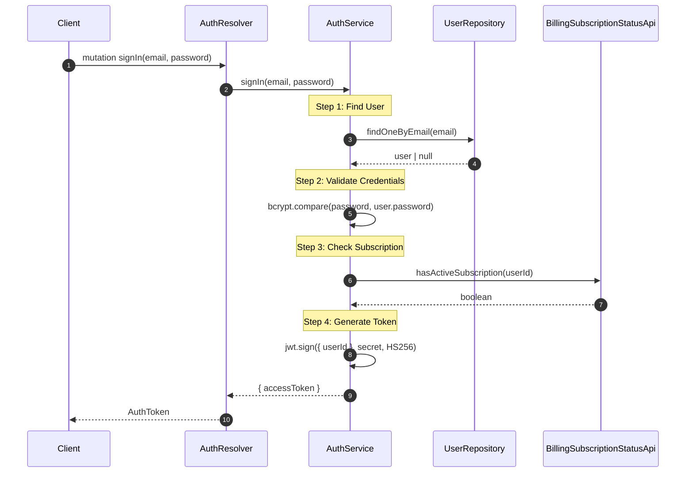
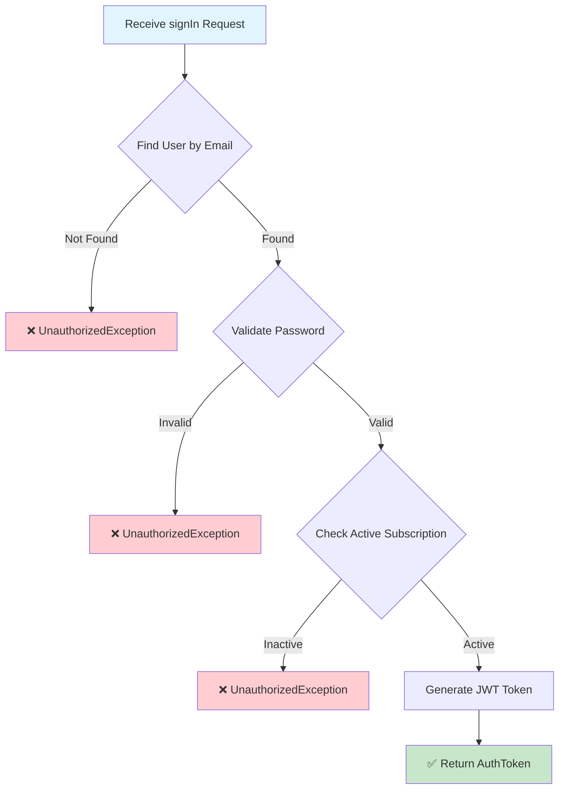
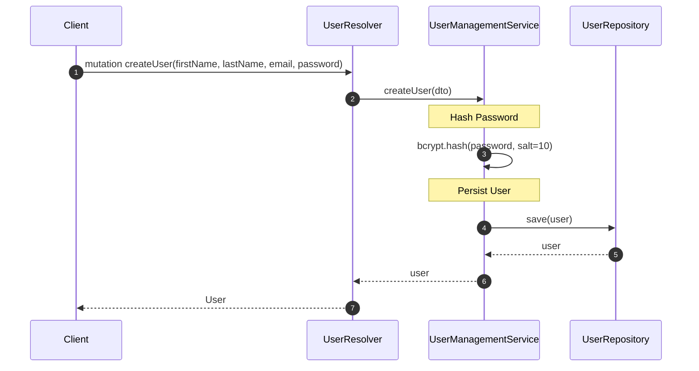

# Identity Module

The identity module handles all user management and authentication operations, including user registration, sign-in, and profile access.

## Key Features

- **User Registration**: Create new users with secure password hashing
- **Authentication**: Sign-in with email/password and JWT token issuance
- **Profile Access**: Retrieve authenticated user profile
- **Subscription Validation**: Enforces active billing subscription on sign-in
- **Access Control**: JWT-based guard for protected endpoints

## Architecture

This module follows the modular architecture principles defined in `docs/MODULAR-ARCHITECTURE-PRINCIPLES.md`.

```
identity/
├── identity.module.ts
├── core/                    # Business logic
│   └── service/
│       ├── authentication.service.ts
│       └── user-management.service.ts
├── http/                    # API layer
│   └── graphql/
│       ├── auth.resolver.ts
│       ├── user.resolver.ts
│       └── type/
│           ├── auth-token.type.ts
│           ├── create-user-input.type.ts
│           ├── sign-in-input.type.ts
│           └── user.type.ts
├── persistence/             # Database layer
│   ├── entity/
│   ├── repository/
│   └── migration/
└── __test__/                # E2E tests
    ├── e2e/
    └── factory/
```

## Flows

### Sign-In Flow



### Sign-In - Process Overview



### Create User Flow



## GraphQL API

### Mutations

| Mutation | Input | Returns | Auth Required |
|----------|-------|---------|---------------|
| `signIn` | `SignInInput` | `AuthToken` | No |
| `createUser` | `CreateUserInput` | `User` | No |

### Queries

| Query | Returns | Auth Required |
|-------|---------|---------------|
| `getProfile` | `User` | Yes |

### Request/Response Examples

#### Sign In

**Request:**
```graphql
mutation {
  signIn(input: {
    email: "user@example.com"
    password: "secret"
  }) {
    accessToken
  }
}
```

**Response:**
```json
{
  "data": {
    "signIn": {
      "accessToken": "eyJhbGciOiJIUzI1NiIsInR5cCI6IkpXVCJ9..."
    }
  }
}
```

#### Create User

**Request:**
```graphql
mutation {
  createUser(input: {
    firstName: "John"
    lastName: "Doe"
    email: "john.doe@example.com"
    password: "secret"
  }) {
    id
    firstName
    lastName
    email
    createdAt
  }
}
```

**Response:**
```json
{
  "data": {
    "createUser": {
      "id": "550e8400-e29b-41d4-a716-446655440000",
      "firstName": "John",
      "lastName": "Doe",
      "email": "john.doe@example.com",
      "createdAt": "2024-01-15T10:00:00.000Z"
    }
  }
}
```

#### Get Profile

**Request:**
```graphql
query {
  getProfile {
    id
    firstName
    lastName
    email
  }
}
```

## Key Services

| Service | Responsibility |
|---------|----------------|
| `AuthService` | Sign-in orchestration, credential validation, JWT issuance |
| `UserManagementService` | User creation and retrieval |

## Related Documentation

- [Architecture Guidelines](../../../docs/ARCHITECTURE-GUIDELINES.md)
- [Modular Architecture Principles](../../../docs/MODULAR-ARCHITECTURE-PRINCIPLES.md)
